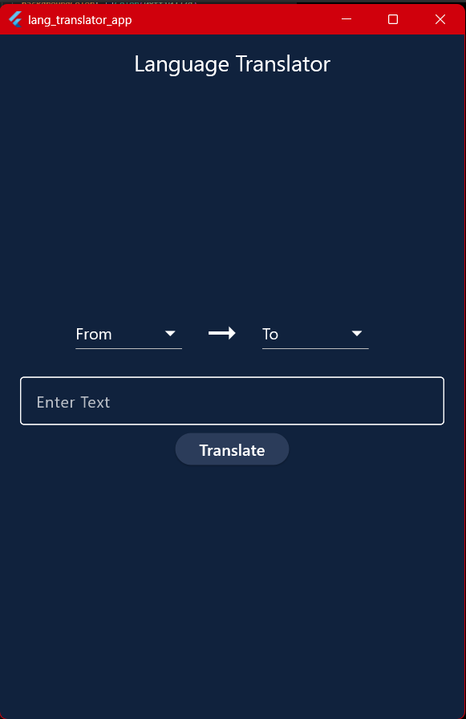
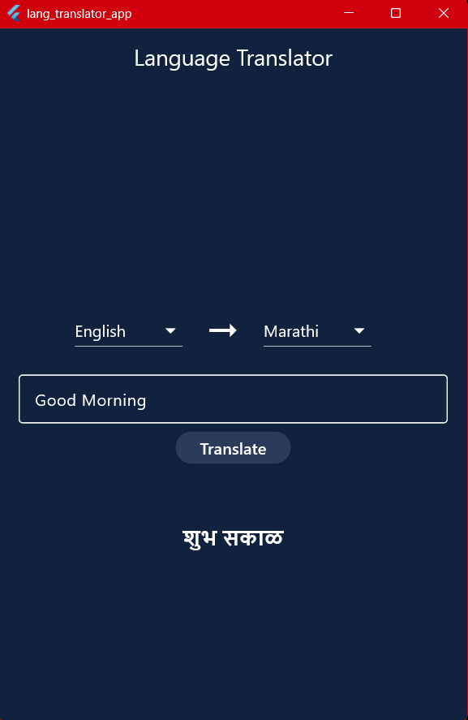

# 🌍 Language Translator App

A modern Flutter application that translates text between multiple languages using **Google ML Kit Translation**. The app provides a simple and intuitive interface for selecting source and target languages and instantly translating text.

---

## ✨ Features

- 🌐 Translate text between multiple languages
- 🔤 Supports 25+ languages
- ⚡ Fast and accurate translations
- 🎨 Clean and modern UI
- 📱 Responsive design
- 🤖 Powered by Google ML Kit Translation
- 🚀 Cross-platform (Android, iOS, Windows)

---

## 📸 Screenshots

<p align="center">
  
  &nbsp;&nbsp;&nbsp;
  
</p>

<p align="center">
  <b>Home Screen</b>
  &nbsp;&nbsp;&nbsp;&nbsp;&nbsp;&nbsp;&nbsp;&nbsp;&nbsp;&nbsp;&nbsp;&nbsp;&nbsp;&nbsp;&nbsp;&nbsp;&nbsp;&nbsp;&nbsp;&nbsp;&nbsp;&nbsp;&nbsp;
  <b>Translation Result</b>
</p>

---

## 🛠️ Tech Stack

- **Flutter**
- **Dart**
- **Google ML Kit Translation**

---

## 📂 Project Structure

```text
lib/
│── main.dart
│── language_translation.dart

android/
ios/
windows/
```

---

## 🚀 Getting Started

### Clone the repository

```bash
git clone https://github.com/Mayurs26/lang_translator_app.git
```

### Navigate to the project

```bash
cd lang_translator_app
```

### Install dependencies

```bash
flutter pub get
```

### Run the application

```bash
flutter run
```

---

## 📦 Dependencies

```yaml
dependencies:
  flutter:
    sdk: flutter

  translator: ^1.0.4+1
```

---

## 🌐 Supported Languages

- English
- Hindi
- Marathi
- Gujarati
- Punjabi
- Bengali
- Tamil
- Telugu
- Kannada
- Malayalam
- Urdu
- Sanskrit
- French
- Spanish
- German
- Italian
- Portuguese
- Russian
- Chinese
- Japanese
- Korean
- Arabic
- Turkish
- Dutch
- Thai
- Vietnamese

---

## 🎯 Future Improvements

- 🔊 Text-to-Speech
- 🎤 Speech-to-Text
- 📋 Copy translated text
- ❤️ Favorite translations
- 🕒 Translation history
- 🌙 Dark/Light Theme
- 📷 Image Text Translation (OCR)

---

## 👨‍💻 Author

**Mayur Sonawane**

GitHub: https://github.com/Mayurs26

---

## ⭐ Support

If you found this project helpful, consider giving it a ⭐ on GitHub!